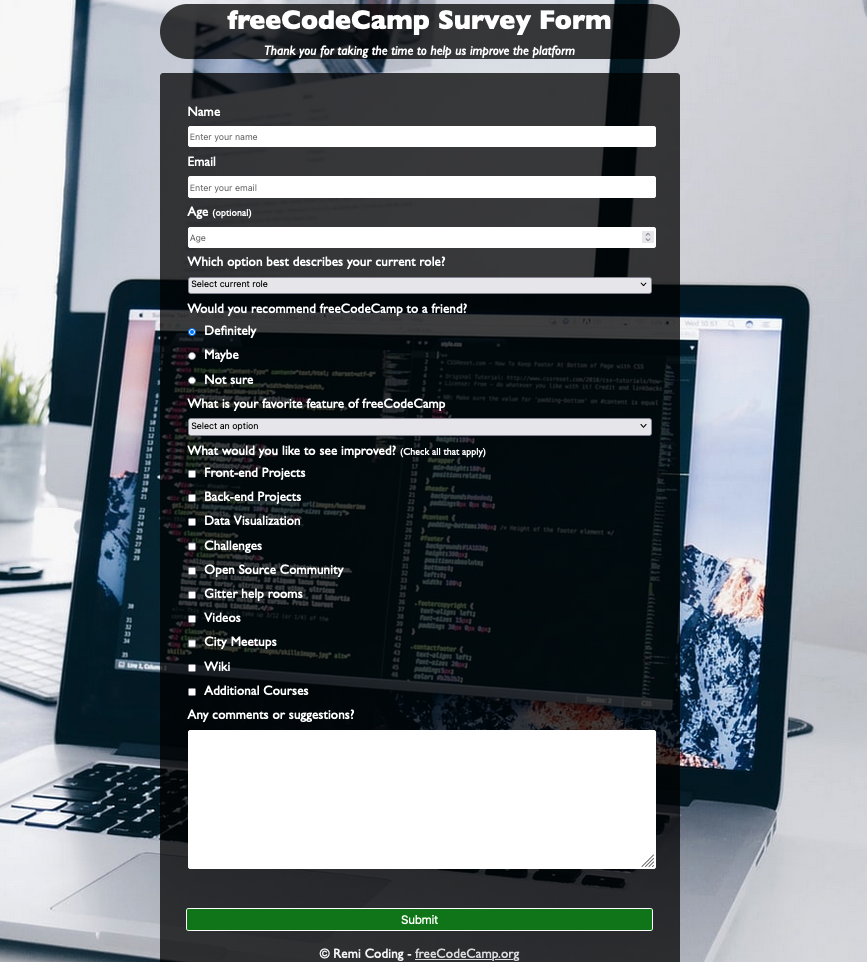

# Survey Form Project

This repository contains the **HTML** and **CSS** for the **Survey Form Project** which is one of the required projects to earn the **Responsive Web Design** certification by [freeCodeCamp](https://www.freecodecamp.org/learn/2022/responsive-web-design/).

The goal of the project is to build a survey form to collect data from users.

The page can be viewed here: [Survey Form](https://remicoding.github.io/survey-form-project/)

For your convenience, here is a screenshot of the project:

